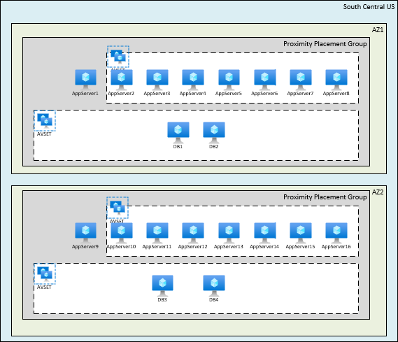
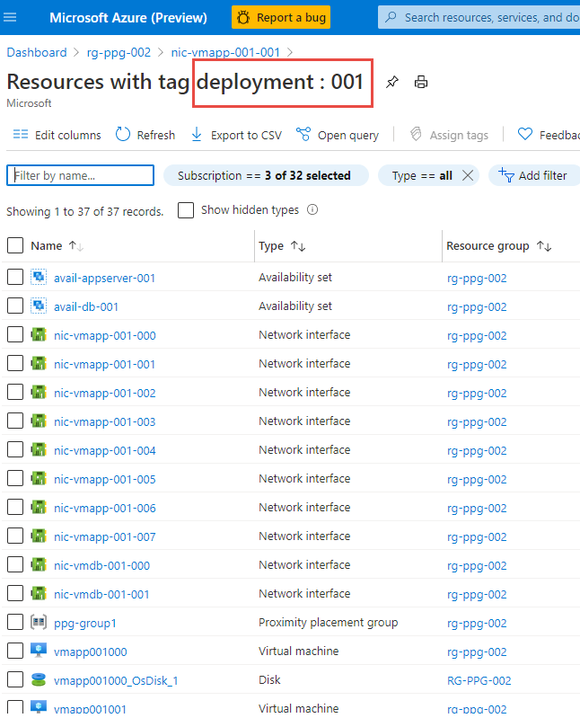
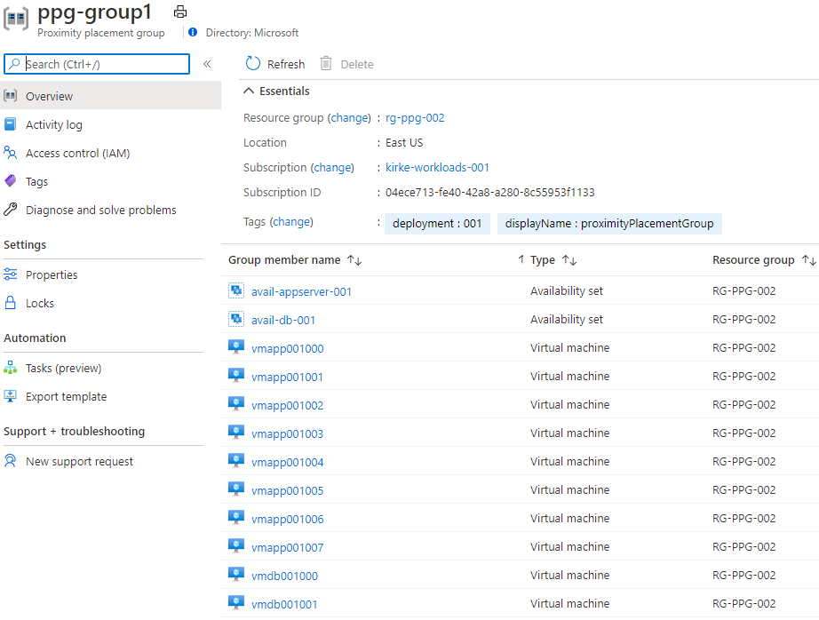
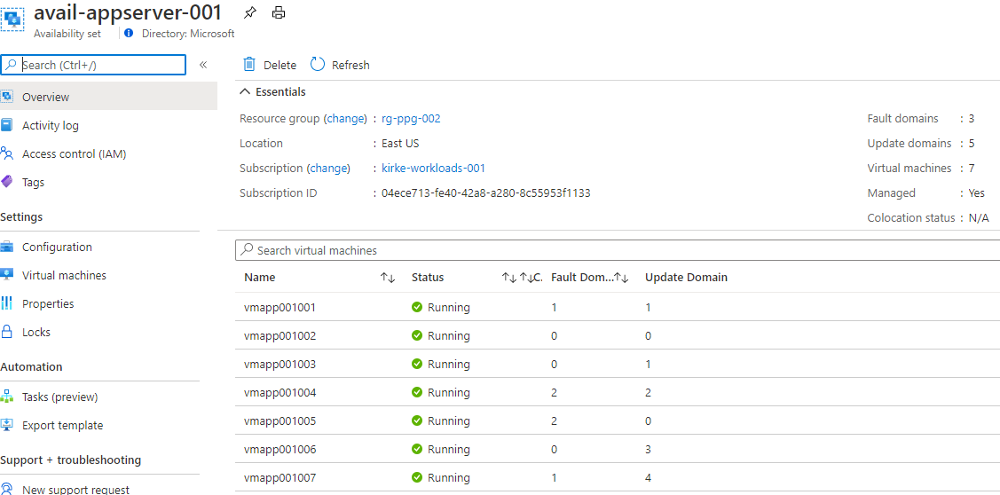
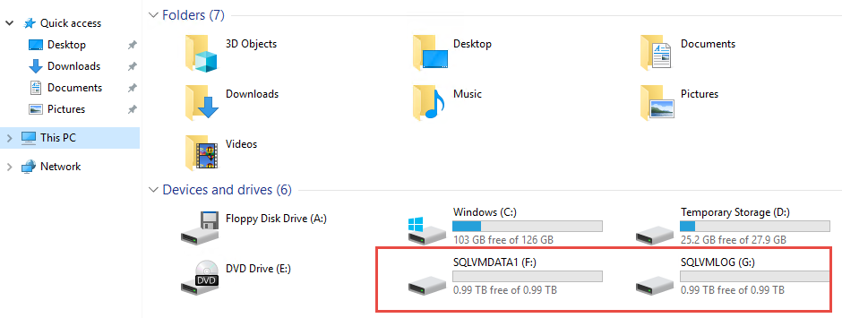
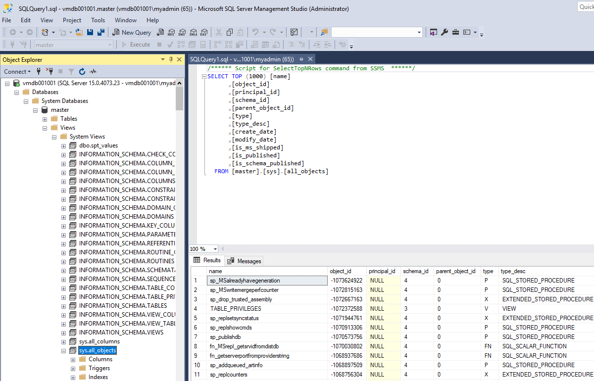
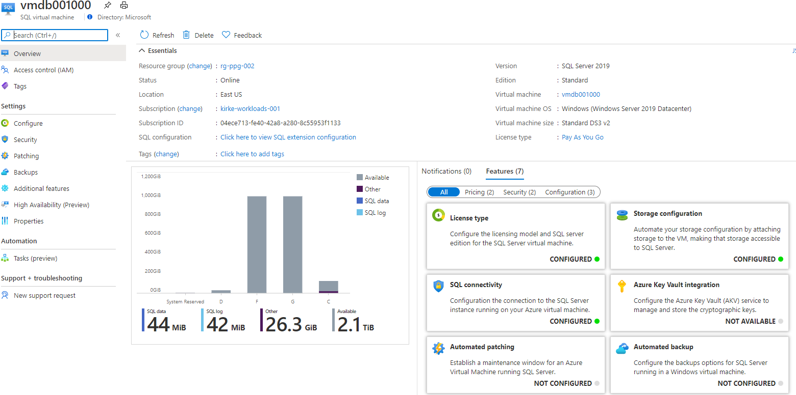

# Combining Azure availability zones and availability sets using a proximity placement group

A fault domain in Azure is a logical group of underlying hardware that share a common power source and network switch, similar to a rack within an on-premises datacenter. An availability set enables grouping of virtual machines to be spread out across up to 3 fault domains. 

It is not currently possible to deploy an Azure availability set into an availability zone. There exists a small chance that multiple VMs deployed to an availability zone could end up with the same fault domain. 

This sample shows how to combine Azure availability zones and availability sets using a proximity placement group. This technique is discussed in the article [Azure proximity placement groups for optimal network latency with SAP applications](https://docs.microsoft.com/en-us/azure/virtual-machines/workloads/sap/sap-proximity-placement-scenarios#combine-availability-sets-and-availability-zones-with-proximity-placement-groups). The deployment looks similar to the following:



One of the application servers is deployed to the availability zone within a proximity placement group. This ensures the VMs within the availability set are in near proximity to the "anchor" application server. Multiple availability sets can be used to reduce latency between application tiers.  

## Deployment
Deployment can be done using the Azure CLI:

````bash
az deployment group create --name ppg1 --template-file azuredeploy.json --parameters @azuredeploy.parameters.json --resource-group rg-ppg-002
````
If you want to deploy many individual proximity placement groups containing their own availability sets, use the deploymentNumber parameter with a unique deployment name for each deployment. This will ensure unique naming of the resources and will appropriately tag each resource.

````bash
az deployment group create --name ppg1  --template-file azuredeploy.json --parameters @azuredeploy.parameters.json --resource-group rg-ppg-002 --parameters deploymentNumber=1 --no-wait

az deployment group create --name ppg2  --template-file azuredeploy.json --parameters @azuredeploy.parameters.json --resource-group rg-ppg-002 --parameters deploymentNumber=2 --no-wait

az deployment group create --name ppg3  --template-file azuredeploy.json --parameters @azuredeploy.parameters.json --resource-group rg-ppg-002 --parameters deploymentNumber=3 --no-wait

az deployment group create --name ppg4  --template-file azuredeploy.json --parameters @azuredeploy.parameters.json --resource-group rg-ppg-002 --parameters deploymentNumber=4 --no-wait

````


## Result
The result of the deployment is a proximity group containing the virtual machines and the availability sets.



The availability set contains all but one application server, with the virtual machines spread across 3 fault domains.



## SQL Server configuration
The SQL Server virtual machines are configured with the `Microsoft.SqlVirtualMachine/SqlVirtualMachines` resource type. This enables configuring the virtual machine including setting up the disks and provisioning the server. For instance, the following disk structure is provisioned within the virtual machine:



The instance is provisioned.



The SQL Server extension is also added to the virtual machine, enabling management of SQL Server from the Azure Portal.

